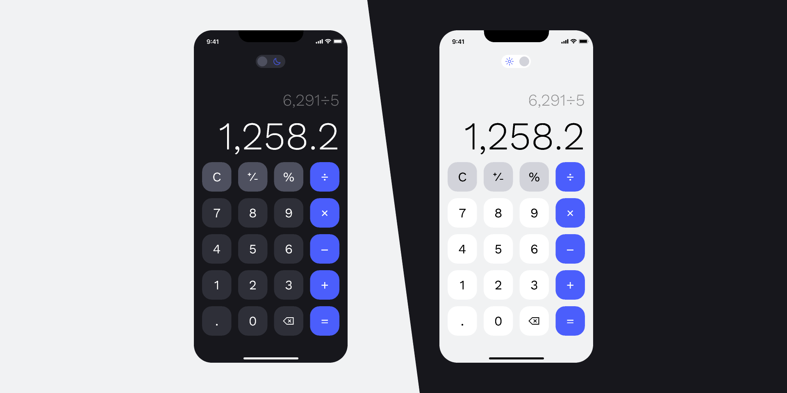

<a name="readme-top"></a>
<div align="center">

  
  

  <h1>Calculator App</h1>
  
  <p>
    Minimalistic <b>Calculator Application</b> with beautiful UI and Theme-Mode feature
  </p>
  
<!-- Badges -->
<p>
  <a href="https://github.com/ladunjexa/Calculator-App/graphs/contributors">
    
  </a>
  <a href="">
    
  </a>
  <a href="https://github.com/ladunjexa/Calculator-App/network/members">
    
  </a>
  <a href="https://github.com/ladunjexa/Calculator-App/stargazers">
    
  </a>
  <a href="https://github.com/ladunjexa/Calculator-App/issues/">
    
  </a>
  <a href="https://github.com/ladunjexa/Calculator-App/blob/master/LICENSE">
    
  </a>
</p>
   
 <h4>
    <a href="https://github.com/ladunjexa/Calculator-App/">View Demo</a>
  <span> · </span>
    <a href="https://github.com/ladunjexa/Calculator-App">Documentation</a>
  <span> · </span>
    <a href="https://github.com/ladunjexa/Calculator-App/issues/">Report Bug</a>
  <span> · </span>
    <a href="https://github.com/ladunjexa/Calculator-App/issues/">Request Feature</a>
  </h4>
</div>

<br />

<!-- Table of Contents -->
<details>

<summary>

# :notebook_with_decorative_cover: Table of Contents

</summary>

- [About the Project](#star2-about-the-project)
  * [Folder Structure](#bangbang-folder-structure)
  * [Environment Variables](#key-environment-variables)
  * [Tech Stack](#space_invader-tech-stack)
- [Getting Started](#toolbox-getting-started)
  * [Installation](#gear-installation)
  * [Run Locally](#running-run-locally)
- [Contributing](#wave-contributing)
- [License](#warning-license)
- [Contact](#handshake-contact)
- [Acknowledgements](#gem-acknowledgements)

</details>  

<!-- About the Project -->
## :star2: About the Project

<div align="center"> 
  
</div>

<br />

Basic and elegant Cross-Platform Calculator App with beautiful and minimalistic User-Interface include Theme-Mode feature (Dark/Light) - built with React Native & TypeScript

<!-- Folder Structure -->
### :bangbang: Folder Structure

Here is the folder structure of Calculator-App.
```
Calculator-App/
|- src/
  |-- components/
  |-- context/
  |-- styles/
|- App.tsx
```

Now, lets dive into the src folder.

### components

`Button.tsx` - `MyKeyboard.tsx`

`Button.tsx` - Implementation of Button component used for numbers, operations and etc.

`MyKeyboard.tsx` - Implementation of calculator keyboard and functionality using React Hooks.

### context

`ThemeContext.tsx`

Context lets components pass information deep down without explicity passing props. ThemeContext call [createContext] outside any component to create Theme-Mode context,
initialize with 'light' value.

### styles

`constants.ts` - Contain only one constant object which holds hexadecimal code of colors used by app.

`theme.tsx` - Impelmentation of a global theme by creating StyleSheet style for buttons and keyboard ui.

<br />

<!-- TechStack -->
### :space_invader: Tech Stack


<p align="right">(<a href="#readme-top">back to top</a>)</p>

<!-- Getting Started -->
## 	:toolbox: Getting Started

<!-- Installation -->
### :gear: Installation

#### Step 1:
Download or clone this repo by using the link below:

```bash
 https://github.com/ladunjexa/Calculator-App
```

#### Step 2:
As a standard practice of React Native projects for managing packages it is prefer to use Yarn, but you can also use NPM.
therefore, at the root folder, execute the following command in console to get the required dependencies:

```bash
  yarn
```

#### Step 3:

At the root folder execute the following command in console to get start the application

```bash
  expo start
```

<!-- Run Locally -->
### :running: Run Locally

#### Step 1:

At the main folder execute the following command in console to get the required dependencies:

```bash
  yarn
```

#### Step 2:

At the root folder execute the following command in console to get start the application

```bash
  expo start
```

<p align="right">(<a href="#readme-top">back to top</a>)</p>

<!-- Contributing -->
## :wave: Contributing

<a href="https://github.com/ladunjexa/Calculator-App/graphs/contributors">
  
</a>


Contributions are always welcome!

See [`contributing.md`](https://contributing.md/) for ways to get started.

Contributions are what make the open source community such an amazing place to learn, inspire, and create. Any contributions you make are **greatly appreciated**.

If you have a suggestion that would make this better, please fork the repo and create a pull request. You can also simply open an issue with the tag "enhancement".
Don't forget to give the project a star! Thanks again!

1. Fork the Project
2. Create your Feature Branch (`git checkout -b feature/AmazingFeature`)
3. Commit your Changes (`git commit -m 'Add some AmazingFeature'`)
4. Push to the Branch (`git push origin feature/AmazingFeature`)
5. Open a Pull Request

<p align="right">(<a href="#readme-top">back to top</a>)</p>

<!-- License -->
## :warning: License

Distributed under the MIT License. See [LICENSE.txt](https://github.com/ladunjexa/Calculator-App/blob/main/LICENSE) for more information.

<p align="right">(<a href="#readme-top">back to top</a>)</p>

<!-- Contact -->
## :handshake: Contact

Liron Abutbul - [@lironabutbul6](https://twitter.com/lironabutbul6) - [@ladunjexa](https://t.me/ladunjexa)

Project Link: [https://github.com/ladunjexa/Calculator-App](https://github.com/ladunjexa/Calculator-App)

<p align="right">(<a href="#readme-top">back to top</a>)</p>

<!-- Acknowledgments -->
## :gem: Acknowledgements

This section used to mention useful resources and libraries that used in Calculator App

 - [expo.dev](https://expo.dev/)
 - #codewithbeto

<p align="right">(<a href="#readme-top">back to top</a>)</p>
